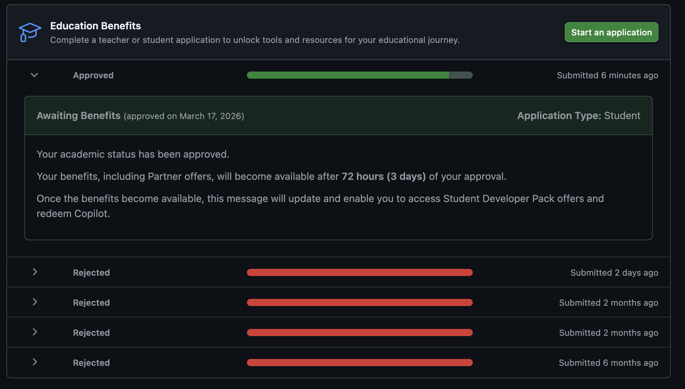

## 注意点
:::message
この記事は**2026/05/02**時点の情報に基づいています。GitHub Educationの申請プロセスや要件は変更される可能性があるため、最新の情報は公式サイトを確認してください。
:::

@[card](https://github.blog/changelog/)

## はじめに
こんにちは、ZAGAROの[ソウ](https://x.com/1987Shiz321)です。

今回は、GitHub Educationの申請を通過するためのポイントについて、実際の申請プロセスや注意点を交えて解説していきます。

主にサークルメンバー向けの内容にはなりますが、備忘録を兼ねて、申請を考えている学生の方々の参考になれば幸いです。

## GitHub Educationとは
> GitHub Education is a community dedicated to empowering the next generation of developers through the power of open-source education. Whether you're a student eager to make your mark, an educator aiming to inspire, or an early career developer looking to sharpen your skills, GitHub Education is here to help you succeed.
※[GitHub Education(公式サイト)](https://github.com/education)より引用

要するに、GitHub Educationは、オープンソース教育の力で次世代のデベロッパーを支援することに尽力しているコミュニティです。学生や教育者、初期キャリアのデベロッパーが成功するためのリソースやサポートを提供しています。

GitHub Educationに参加することで、学生は無料でGitHub Proの機能を利用できるほか、さまざまな開発ツールやサービスへのアクセスが可能になります。

## 私の申請経験
実際に私は4度のリジェクト(申請拒否)を経験したのちに、5度目の申請でようやく通過することができました。

*4度の失敗を経て、2026/3/17に申請通過...!*

## 前提条件
以下の条件を満たしていることが前提となります。
- 教育機関に所属していること。
- GitHubのアカウントを持っていること。また、同サービス上で一定の操作ができること。
- 学生証や在学証明書など、所属を証明するための書類を用意できること。
## 申請拒否の理由
4度の申請拒否の理由は以下の通りです。

:::details 拒否された理由(原文)
> We were unfortunately not able to verify your academic status. Please address the following issues and apply again.
>
> - The image you used appears to be edited. Manipulated images may not be used. Please try a different image.
> - Please complete your GitHub billing information with your full name exactly as it appears in your academic affiliation document. You do not have to add a payment method. You may need to log out and log back in to GitHub before reapplying. If you have only a single legal name, enter it in both the first and last name fields.
> - You are unlikely to be verified until you have completed your GitHub user profile with your full name exactly as it appears in your academic affiliation document. Please do not use a variation of your name or a nickname. Once you have updated your profile information log out and log back into GitHub before re-applying.
> 
> Visit our EDU community for FAQs and tips.
:::

GitHub側からのリジェクト理由を読むと、通過のためには以下の点に気をつけなければならないそうです。

### **画像の再提出**
- 現在アップロードされている画像は加工・編集されていると判断されている模様。
- 無加工の別の画像を用意してほしいとのこと。
### **請求情報の修正**
- GitHubの請求先氏名を、提出書類と完全に一致するフルネームに変更する必要がある。
- 姓と名が分かれている場合は、両方の欄にその名前を入力。
- ※支払い方法（クレジットカード等）の登録は不要。
### **プロフィールの更新**
- GitHubのユーザープロフィール名も、提出書類と完全に一致するフルネームに変更しなければならない。
- ニックネームや略称は使用せず、正式な名称を入力する必要がある。
### **ログアウトと再ログイン**
- 上記の情報を更新後、必ず一度GitHubからログアウトし、再度ログインしてから再申請を行うこと。

## 申請通過をした際の条件
私が申請通過した際の条件は以下の通りです。
- **学内のネットワークから申請をした。**
- 学生証と、名前や学部などの各項目を英語で記載した紙を一緒に撮影した写真を提出した。
- 申請の際に、大学のメールアドレス(ac.jp)を使用した。
- Payment information内の(Billing information)には、自分の名前と住所を英語で記載した。
- ログアウトしてから再度ログインして申請を行った。

個人的には一番上が重要なポイントだと感じました。というのも、申請をする際に位置情報を共有する必要があるのですが、大学内のネットワークから申請をすることで、大学に所属していることがより明確になるようです。

大学内のネットワークから申請することができる場合は、ぜひ試してみてください。

:::message
今回のケースは、あくまでも私の経験に基づくものであり、すべての申請者に当てはまるわけではありません。申請プロセスや要件は変更される可能性があるため、最新の情報は公式サイトを確認してください。
:::

## やらなかったこと
- 再提出時に、提出する画像を変更すること
- GitHubのユーザープロフィールを本名に変更すること

画像は編集してすらないので、再提出の際も同じ画像を使用しました。ただ、提出時にサイズ上限を超えていないかどうかは確認しておいた方がいいでしょう。

GitHubのユーザープロフィールを本名に変更することは、個人的には抵抗がありました。私は変えることなく申請を通過できたので、必ずしも必要な条件ではないのかもしれません。

学内ネットワークからの申請でも通過できない場合は、最終手段としてプロフィールの名前を変更することも検討してみてください。

## おわりに
GitHub Educationの申請を通過するためには、いくつかのポイントに注意する必要があります。今回の記事が、申請を考えている学生の方々の参考になれば幸いです。

繰り返しにはなりますが、申請プロセスは変更される可能性があるため、最新の情報は公式サイトを確認してください。

それでは、良きコーディングライフを！

## 参考にした記事(外部リンク)
@[card](https://note.com/tamutamu0/n/n1e71b132059e)
@[card](https://qiita.com/4kin0ri/items/1f2e2a57123cf954c65c)
