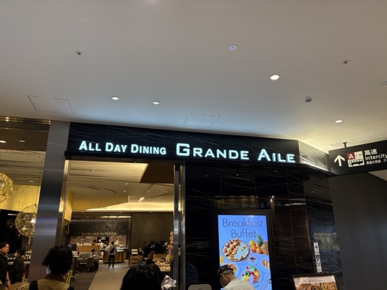
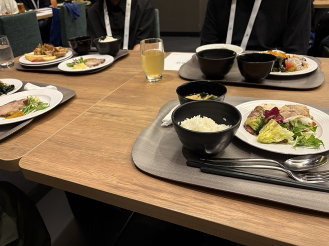

## はじめに

こんにちは、ZAGARO の[ソウ](https://x.com/1987Shiz321)です。2026 年 5 月 22 日と 23 日にベルサール羽田空港で開催された国内最大級の TypeScript カンファレンス「TSKaigi 2026」に学生支援制度で参加してきました！

## 【TSKaigi 2026 学生支援企業】

- 株式会社アイスタイル
- 株式会社アサイン株式会社
- 株式会社 SmartHR
- ソフトバンク株式会社
- 株式会社ドワンゴ
- 株式会社プレイド
- 株式会社 LayerX
- レバレジーズ株式会社

## 私と TypeScript

私は TypeScript 歴で言えば、まだ 1 年あるかないかくらいです。普段は個人開発やサークル活動で触っていて、「JavaScript に型を付けることで安全に書ける言語」という認識を持ちながら使っていました。現在お読みいただいているブログも、TypeScript で書いています。

もちろん、型を書けるようになるだけでもかなり便利で、「TypeScript すげぇ！」と思っていたのですが、今回のカンファレンスに参加して、言語の奥深さや型を活用した設計の世界を少し垣間見ることができたように感じています。

## 事前イベント

イベント前には、当日の体験を有意義にするための交流会がありました。時間は 1 時間半ほどで、各企業の会社紹介や TSKaigi の楽しみ方を説明いただくとともに、ブレイクアウトルームで交流会も行いました。

私はカンファレンスの参加回数が少ない上、言語にまつわるカンファレンスは今回が初めてでした。その中で、株式会社プレイドの小林さんが「**発表の内容は気楽に聞こう。分からなくても落ち込まない！**」と楽しみ方のアドバイスを話していたことが印象に残りました。前述の通り、歴も浅い自分にとっては分からないことだらけになるとは予想がつきます。その中でも、興味を持ったことやこれはすぐ使えそうかも！と思ったところはしっかりメモしようと心がけましたね。

ブレイクアウトルームでの交流会では、株式会社プレイドと株式会社 SmartHR の社員の方々とお話しました。その中では、最近の技術トレンドや AI ツールの話で盛り上がった他、他の学生がどんなことに熱中しているのかを知ることができて、すごく刺激になりました。当日のセッションで楽しみにしているものを社員の方々に聞くこともできました。

## スカラシップランチ

Day1 の昼食は、学生向けのスカラシップランチが提供されました。TSKaigi の本会場のすぐ近くにあるレストランで、参加者同士やスポンサー企業の方々と交流しながら食事を楽しむことができました。

_会場のオールデイダイニング グランドエール。豪華な雰囲気!_

主な構成としては、1 テーブルにつき学生 5~6 名とスポンサー企業の社員の方が一人ずつ座る形で、ランチを楽しみながら交流するというものでした。私はソフトバンク株式会社の社員の方と同じテーブルになり、様々な話をしました。特に印象に残っているのは、同じ会社の中でも、組織やプロジェクトによって最新の AI ツールの活用状況が大きく違うという話でした。組織内で最新の技術トレンドやツールにアンテナを張っている人がいたり、チームメンバーがそれらに寛容な雰囲気だとありがたいですよね。

_実際の食事の様子。ごちそうさまでした。_

## Day1 / Day2 の感想

### セッションを通して「型安全」のイメージが変わった

今回のセッションでは、**Discriminated Union** の活用や、JSX の構造設計、UI コンポーネントをどのように型で制約していくか、といった話が印象に残りました。正直、全部を理解できたかと言われると全然そんなことはなくて、一緒に参加した友達とも「たぶん 10%も理解できてないよね」「いや、5％くらい？笑」と話していたくらいですね。

でも、不思議と置いていかれた感覚ではなくて、「TypeScript を深く使うと、こういう世界があるんだ」という景色を見せてもらった感覚に近かったです。これまでは、「型を書く」という行為を単なる“補助”のように捉えていました気がします。しかし実際の発表では、型を使って実装者のミスを防いだり、コンポーネントの責務を整理したり、間違った使い方そのものをできなくする設計として TypeScript が使われていました。「**型は注釈ではなく、設計そのものか！**」と感じた瞬間が何度もありました。

今すぐ自分のコードに活かせるかと言われると、正直まだ難しいですね。しかし、「今後もっと大規模開発をした時、この知識が繋がるんだろうな」という感覚は強く感じます。それがいつになるのかわからないけど...。

#### 印象に残ったセッション一覧

- [業務に残された「よくない型」で考える「TypeScript の難しさ」（Saji）](https://2026.tskaigi.org/talks/5)
- [TypeScript だけで AI エージェントを作る ― フロント・エージェント・インフラのフルスタック実践（福地開）](https://2026.tskaigi.org/talks/20)
- [TypeScript の型だけでオセロを完全実装する ── 型は"仕様"をどこまで語れるか（籏野 拓）](https://2026.tskaigi.org/talks/34)
- [「雰囲気 tsconfig」からの脱却：pnpm モノレポ運用で学び直した Project References の基礎と実践（hedrall）](https://2026.tskaigi.org/talks/36)
- [制約と時代から読み解く TypeScript コンパイラ設計史（Yoshiaki Togami）](https://2026.tskaigi.org/talks/38)
- [React の props は値の集合ではない — UI の状態を宣言するコンポーネント設計（nabeliwo）](https://2026.tskaigi.org/talks/41)
- [Auth.js から Better Auth への移行に見る「型とランタイム」の設計思想の変化（宇根昇汰）](https://2026.tskaigi.org/talks/43)
- [TypeScript はどのようにどこまで推論できるのか ─ とにかく as は禁止で（ypresto）](https://2026.tskaigi.org/talks/81)
- [Hono RPC と Drizzle ORM で実現する、AI にも優しい TypeScript ファーストな開発（Yudai Shinnoki）](https://2026.tskaigi.org/talks/61)

### スポンサーブースで感じた“技術を追い続ける人たち”の熱量

今回かなり印象的だったのが、スポンサーブースでの交流でした。

学生向けのカンファレンスに参加していたこともあるので、最初は「企業説明を聞く場所」くらいのイメージだったのですが、実際にはかなり技術者同士のコミュニケーションの場に近くて、どのブースでもかなり深い話を聞かせてもらえました。様々な企業との交流の中で、自分の知らないフレームワークやツールの話を聞くことができましたが、やはりそれ以上に印象的だったのは、そこで話してくれたエンジニアの方々の熱量でした。

単なる会社紹介ではなく、「実際の現場でどういう問題があって、どんなアプローチで切り抜けたか」まで含めて話してくれる方が多く、かなり刺激を受けました。技術面接では問題解決のプロセスをよく聞かれましたが、まさにそのプロセスをリアルに聞けるような場だったと思います。

経験年数に関係なく、みんな本当に技術が好きで追い続けているんだな、というのがすごく伝わってきました。自分よりずっと長く業界にいるエンジニアの方でも、新しい技術の話を楽しそうにしていて、「最近これ試してるんですよね」「こういうの使ってみるといいですよ！」とワクワクしながら話している姿がすごく印象に残っています。

また、「自分が若手だった頃」の話を聞けたのも大きかったです。
今すごい人でも、最初から何でもできたわけじゃなくて、試行錯誤しながらここまで来たんだな、というのが少し見えた気がしました。

### おまけ: ブースの抽選で技術書が当たっていた！

@[tweet](https://x.com/1987Shiz321/status/2057642055275585970)
3-shake さんのブースで抽選に参加したら、なんと技術書が当たりました！めちゃくちゃ嬉しいです。ありがとうございます！
「技術書、当てちゃおうかな〜」って言いながら引いたら本当に当たってびっくりしました。動揺したあまり、写真撮影の際に技術書ではなく抽選に使われる赤玉を持ってしまうという失態もありました笑。

### 懇親会での交流

1 日目の Drink Up や、2 日目の懇親会でも、多くの方と話をさせていただきました。実は、自分はオフラインイベントで人に話しかけるのがかなり苦手です。「自分なんかが話しかけていいのかな」「相手の時間を奪ってしまわないかな」みたいなことを結構考えてしまっていて、参加前はかなり緊張していました。

でも、実際に話したエンジニアの方々が口を揃えて言っていたのが、「**オフラインイベントに来ている人は、みんな交流したいと思って来ている**」ということでした。

「目が合ったらポケモンバトルみたいなものだから、どんどん話しかけていいよ！」「申し訳なさは捨てたほうがいい」という言葉は、かなり印象に残っています。めちゃくちゃ勇気が出ました。実際、少し勇気を出して話しかけてみると、そこから自然に技術の話が始まり、キャリアの話になり、開発環境や AI ツールの話になっていきました。「イベントって、こうやって人とつながる場所なんだな」と実感した瞬間でした。オンラインではなかなかできない、オフラインならではの体験だったと思います。

個人的には、Zoom などのオンラインイベントも便利で好きですが、そこでのコミュニケーションってどうしても「話すことを選ぶ」感じが強いと思います。気さくに話しかけることができるオフラインイベントは、やっぱり特別なものだなと感じました。

@[tweet](https://x.com/1987Shiz321/status/2057712197640634538)
ネイルができるブースがあり、友人と一緒にネイルをしてもらいました笑。TS カラーのネイル、これ以外あり得ない(過激派)。

### サークル運営に自信を持てた(かもしれない)

懇親会では、自分が大学で運営しているエンジニアサークルの話もしました。去年立ち上げたサークルで、最近は新入生向けに、右も左も分からない状態からスキルを身につけられるようなカリキュラム作りを進めています。その話をした時に、「学生の頃、そこまで考えられていなかった」「そういう環境を作ろうとしているのはすごいと思う」と言っていただけたのが、かなり嬉しかったです。

普段、自分がやっていることって、本当に意味があるのか分からなくなる瞬間があります。特に地方にいると、活動を客観的に見てもらえる機会はそこまで多くありません。だからこそ、こういったコミュニティで、しかも現場で長くやってきた方々から肯定的な言葉をもらえたことは、自分の中でかなり大きな経験になりました。

## おわりに

今回の TSKaigi 2026 への参加は、単なる技術イベント参加以上の体験でした。TypeScript の知識だけではなく、「技術を深く追いかけるとはどういうことか」「コミュニティとはどういうものか」「エンジニア同士のつながり、めちゃくちゃ心地がいい」など、様々なことを感じることができた 2 日間だったと思います。

静岡から東京に出て、多くのエンジニアの方々と交流できたことは、自分にとってかなり大きな刺激になりました。今回お話してくださった皆さん、本当にありがとうございました。

そして、運営の皆さま、登壇者の皆さま、スポンサー企業の皆さま、本当に素晴らしいイベントをありがとうございました。TSKaigi 2026 は、自分にとって技術的にも、人とのつながりという意味でも、非常に刺激の多い 2 日間でした。
また来年も参加できることを楽しみにしています！
@[tweet](https://x.com/tskaigi/status/2058124855074259390)

またどこかのイベントでお会いできたら嬉しいです。それではまた！

## TSKaigi 2026 公式サイト

@[card](https://2026.tskaigi.org/)
