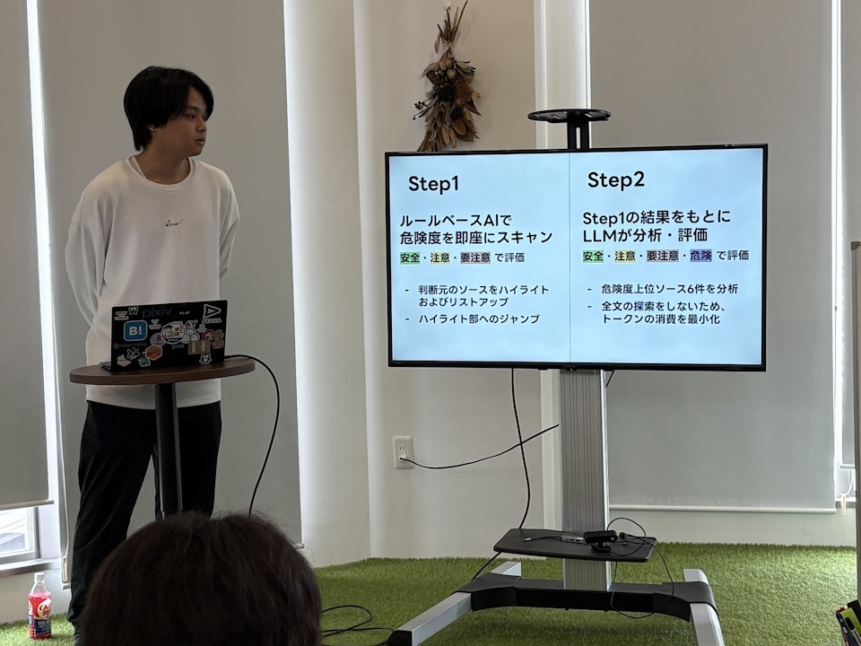
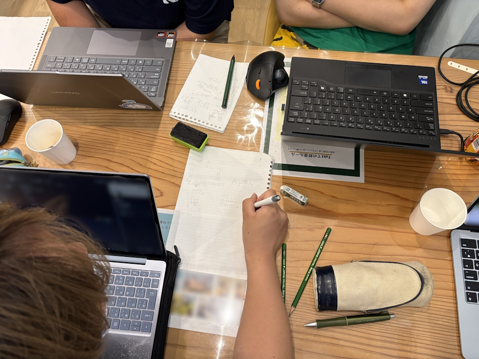
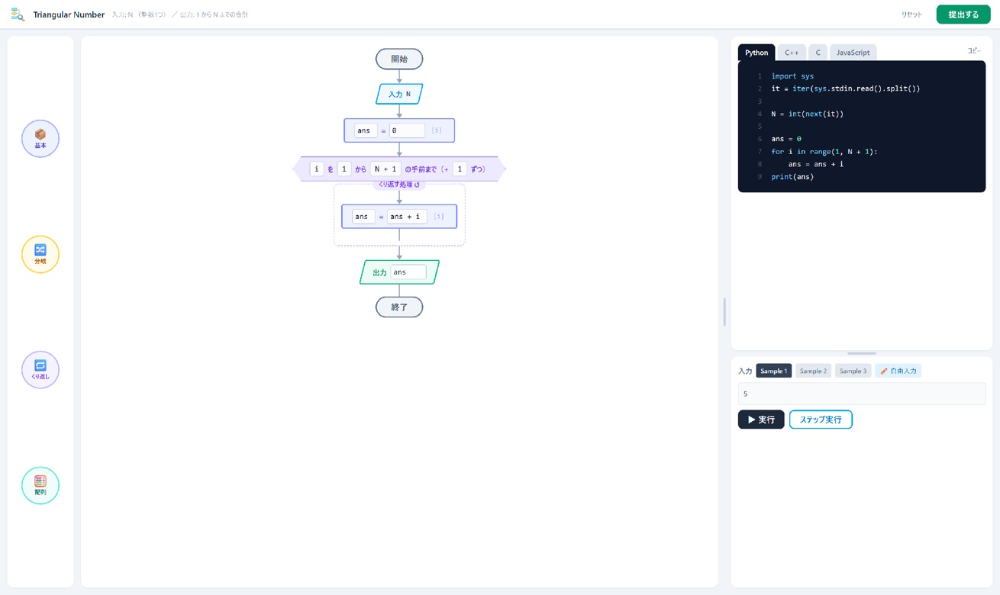
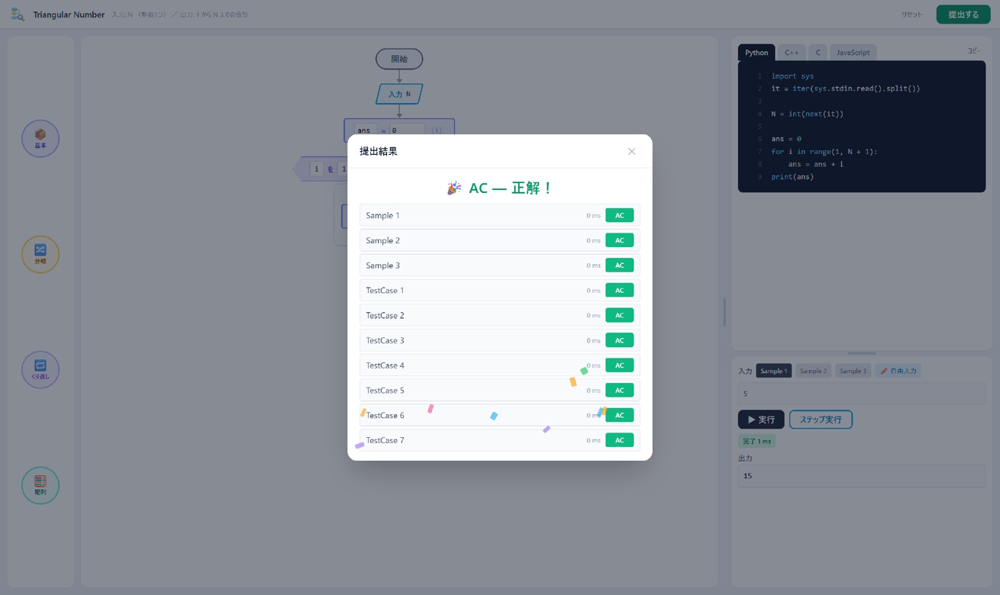
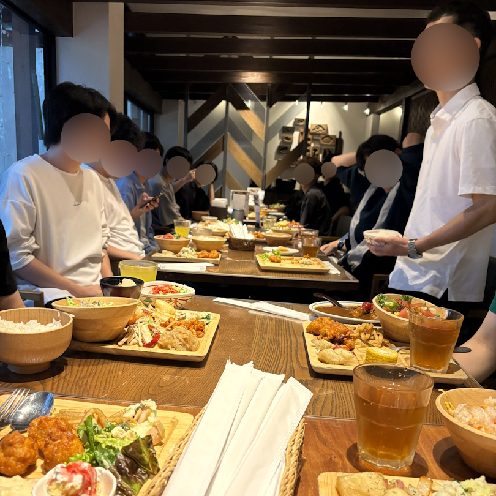

## はじめに

こんにちは、ZAGARO の[ソウ](https://x.com/1987Shiz321)です。今回は、2026 年 7 月 5 日にコラボレーションスペース takt で開催された新入生歓迎会と食事会の様子をお伝えします！新入部員の皆さんに向けて、競技プログラミングやハッカソンを通じて交流を深めるイベントを企画しました。

## ゆるハッカソン

歓迎会の最初は、「ゆるハッカソン」と題してメンバー個人が事前に開発した作品を紹介することから始まりました。今回は 6 名のメンバーが作品を発表し、作品のデモや開発のこだわりなどを共有しました。新入部員だけでなく、既存のメンバーも刺激を受ける時間となりました。

_発表の様子_

### ハッカソン作品一覧

- 日程決め太郎: 既存ツールの課題を解決する日程調整/共有アプリケーション
- KumiCode: コーディングの知識を必要とせずにアルゴリズムを組み立てられる Web アプリケーション
- TermsGuard: ルールベース AI と LLM を活用した利用規約の要約/分析を行うブラウザ拡張機能
- Music Practice Hub: 動画収集サイトでバンド練習を快適にする Web アプリケーション
- DeTailor: 日々の出来事に基づいて AI が日記を生成する Web アプリケーション
- ポータブル財布: 毎日の予算をゲーム感覚で管理するアプリケーション

---

ハッカソンの終了後は、誰が一番面白い作品を作ったかを決める投票を行いました。投票の結果、最も票を集めた作品は「日程決め太郎」でした。既存ツールの課題を解決するために開発されたこちらの作品は、ユーザーがより簡単に日程を調整・共有できるように設計されており、メンバーから高い評価を受けました。

こちらの作品は一般向けにも公開されているので、興味のある方はぜひチェックしてみてください！

@[card](https://www.nittei-taro.com/)

## 競技プログラミングバトル

ハッカソンの後は、競技プログラミングの問題を解くバトルが行われました。新入部員と既存メンバーがチームを組み、制限時間内にできるだけ多くの問題を解くことを目指しました。このバトルは前半と後半に分かれており、前半では簡単な問題でウォーミングアップを行い、後半では難易度の高い問題に挑戦しました。新入部員は既存メンバーのサポートを受けながら協力して問題を解くことで、チームワークの大切さを実感しました。

_問題のアプローチをメンバー間で共有している様子_

また、コードの書き方に慣れていない新入生にも配慮して、GUI を使って問題を解く環境をサークル代表の[リタ](https://x.com/takami_ku_)が用意してくれました。これにより、プログラミング初心者でも問題に挑戦しやすくなり、参加者全員が楽しめる環境が整いました。

_パレットからブロックをドラッグ＆ドロップするだけで問題が解ける_

_サーバー不要で提出結果が表示される_

問題を解いて獲得したポイントを消費して難しめの問題のヒントを得ることができるルールがあり、戦略的にポイントを使う試みも見られました。結果は全チームが同じ点数で引き分けとなりましたが、参加者同士での交流が深まり、楽しい時間を過ごすことができました。

## 食事会

あっという間に時間が過ぎ、夕食の時間となりました。食事会は「[ぶどうの丘 草薙](https://budou-oka.jp/kusanagi/)」にて行われ、食事をしながら交流を深めることができました。

個人的には、顧問の先生と話した「２年前に授業内の演習で作ったプロジェクト」について印象が残っています。LINE のチャットボットを作っていましたが、外部サービスとの連携の仕方が当時は全く分からなかったので、いつかは実装してみたいという話をしていました。

先日 PC の整理をしていたらその時のソースコードが出てきたことをお話したら、「リメイクとして作ってみたらどう？」と先生に提案され、今の自分なら十分実現できそうだから、ぜひ挑戦してみたいと思いました。こうした会話を通じて、技術的な成長や新しいアイデアのきっかけを得ることができるのも、食事会の魅力の一つです。あと、ご飯がとても美味しかったです！ごちそうさまでした。

## おわりに

今回は、新入生歓迎会と食事会の様子をお伝えしました。競技プログラミングやハッカソンを通じて、メンバー同士の交流が深まり、新入部員の皆さんも楽しんでいただけたようです。今後も ZAGARO では、さまざまなイベントや活動を通じて、メンバー同士のつながりを大切にしていきたいと思います。それではまた！
